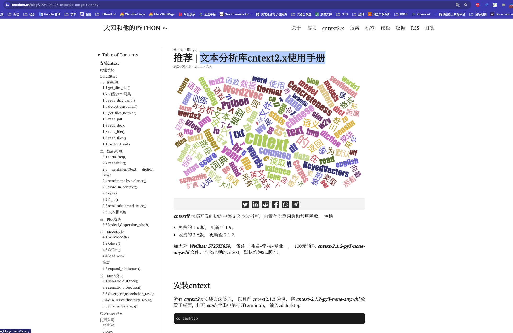
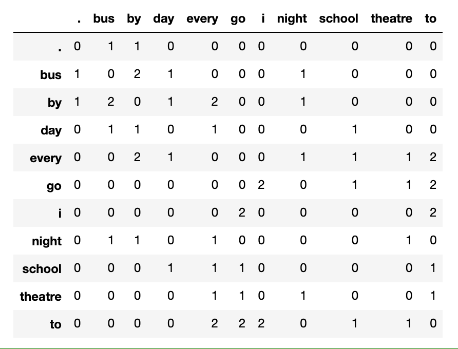
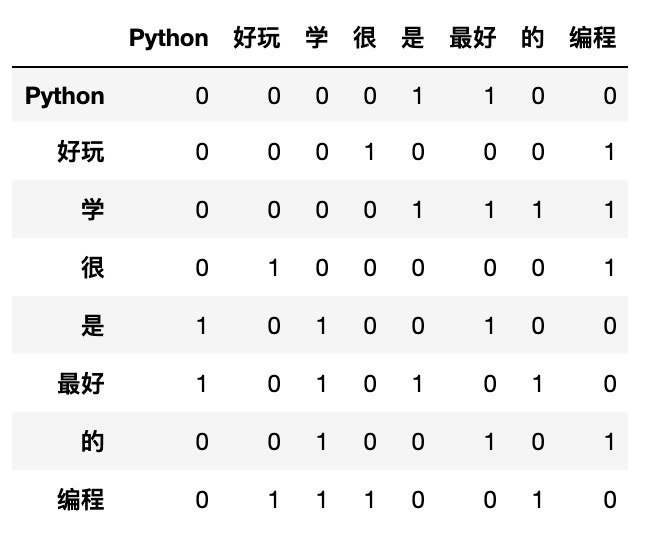
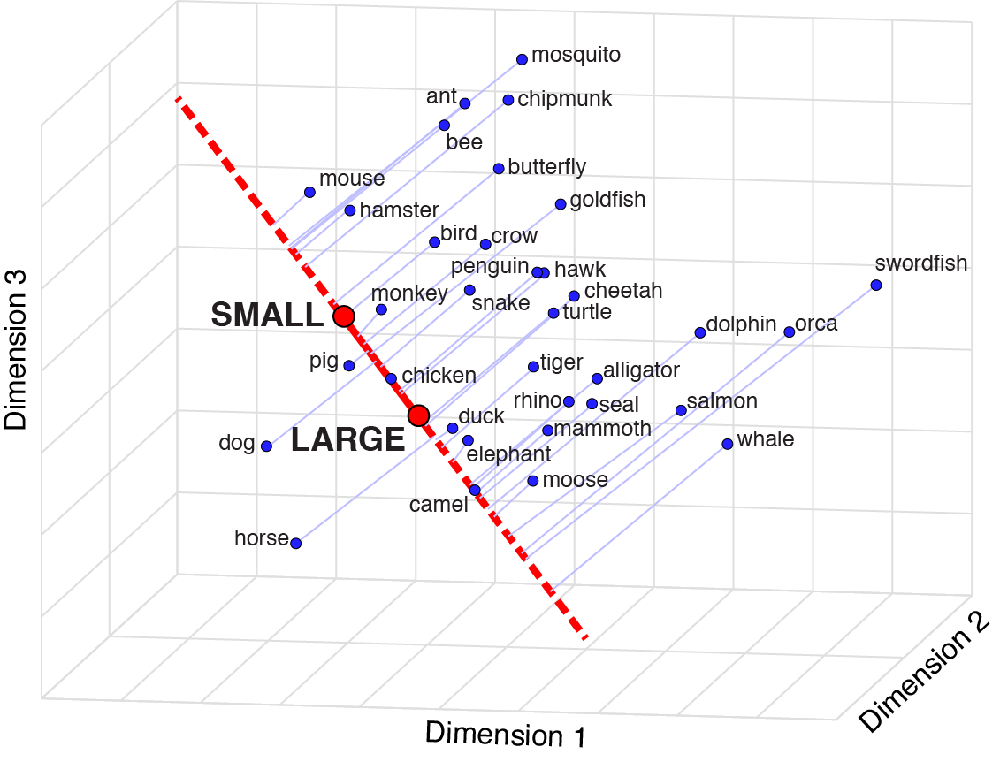

<!-- START doctoc generated TOC please keep comment here to allow auto update -->
<!-- DON'T EDIT THIS SECTION, INSTEAD RE-RUN doctoc TO UPDATE -->
**Table of Contents**

- [功能模块含](#%E5%8A%9F%E8%83%BD%E6%A8%A1%E5%9D%97%E5%90%AB)
- [安装](#%E5%AE%89%E8%A3%85)
- [QuickStart](#quickstart)
- [一、stats](#%E4%B8%80stats)
  - [1.1  readability](#11--readability)
  - [1.2  term_freq](#12--term_freq)
  - [1.3 dict_pkl_list](#13-dict_pkl_list)
  - [注意:](#%E6%B3%A8%E6%84%8F)
  - [1.4 load_pkl_dict](#14-load_pkl_dict)
  - [1.5 sentiment](#15-sentiment)
  - [1.6 sentiment_by_valence()](#16-sentiment_by_valence)
- [二、dictionary](#%E4%BA%8Cdictionary)
  - [2.1 SoPmi 共现法](#21-sopmi-%E5%85%B1%E7%8E%B0%E6%B3%95)
  - [2.2 W2VModels 词向量](#22-w2vmodels-%E8%AF%8D%E5%90%91%E9%87%8F)
  - [需要注意](#%E9%9C%80%E8%A6%81%E6%B3%A8%E6%84%8F)
  - [2.3 co_occurrence_matrix](#23-co_occurrence_matrix)
  - [2.4  Glove](#24--glove)
- [三、similarity](#%E4%B8%89similarity)
- [四、Text2Mind](#%E5%9B%9Btext2mind)
  - [4.1 tm.sematic_distance(words, c_words1, c_words2)](#41-tmsematic_distancewords-c_words1-c_words2)
  - [4.2 tm.sematic_projection(words, c_words1, c_words2)](#42-tmsematic_projectionwords-c_words1-c_words2)
- [引用声明](#%E5%BC%95%E7%94%A8%E5%A3%B0%E6%98%8E)
  - [apalike](#apalike)
  - [bibtex](#bibtex)
  - [endnote](#endnote)
- [如果](#%E5%A6%82%E6%9E%9C)
- [更多](#%E6%9B%B4%E5%A4%9A)

<!-- END doctoc generated TOC please keep comment here to allow auto update -->

[](https://zenodo.org/badge/latestdoi/487297608)


## [English Docs](english_readme.md)

<br><br>

**cntext** 是一个文本分析包，提供基于词嵌入模型的语义距离和语义投影。 此外，cntext还提供了传统的方法，如字数统计、可读性、文档相似度、情感分析等。 

- [github repo](https://github.com/hidadeng/cntext) ``https://github.com/hidadeng/cntext``
- [pypi link](https://pypi.org/project/cntext/)  ``https://pypi.org/project/cntext/``

根据 [pepy网站](https://www.pepy.tech/projects/cntext) 统计，截止 2024-5-14, 累积下载量  45,305 。 目前分为

- 公开cntext1.x ， 免费， 已更新至1.9
- 非公开cntext2.x， 付费，已更新至2.1.2。 cntext新增了一些特色功能，感兴趣的可以点击阅读[博客: 文本分析库cntext2.x使用手册](https://textdata.cn/blog/2024-04-27-cntext2x-usage-tutorial/)

[](https://textdata.cn/blog/2024-04-27-cntext2x-usage-tutorial/)


<br><br>


## 功能模块含

- [x] **stats**  文本统计指标
  - [x] 词频统计
  - [x] 可读性
  - [x] 内置pkl词典
  - [x] **情感分析**
- [x] **dictionary** 构建词表(典)
  - [x] Sopmi 互信息扩充词典法
  - [x] W2Vmodels 词向量扩充词典法
  - [x] Glove Glove词向量模型
- [x] **similarity**   文本相似度
  - [x] cos相似度
  - [x] jaccard相似度
  - [x] 编辑距离相似度
- [x] **mind.py** 计算文本中的认知方向（态度、偏见）


<br>

## 安装

```
pip install cntext --upgrade
pip install numpy==1.24.2
pip install gensim==4.2.0
pip install scikit-learn==1.1.2
```


<br>

## QuickStart 

```python
import cntext as ct

help(ct)
```

Run

```
Help on package cntext:

NAME
    cntext

PACKAGE CONTENTS
    mind
    dictionary
    similarity
    stats
```


<br>


## 一、stats

目前stats内置的函数有

- **readability**  文本可读性
- **term_freq** 词频统计函数
- **dict_pkl_list**  获取cntext内置词典列表(pkl格式)
- **load_pkl_dict** 导入pkl词典文件
- **sentiment** 情感分析
- 


```python
import cntext as ct

text = '如何看待一网文作者被黑客大佬盗号改文，因万分惭愧而停更。'

ct.term_freq(text, lang='chinese')
```

Run

```
Counter({'看待': 1,
         '网文': 1,
         '作者': 1,
         '黑客': 1,
         '大佬': 1,
         '盗号': 1,
         '改文': 1,
         '因':   1,
         '万分': 1,
         '惭愧': 1,
         '停': 1})
```

<br>


### 1.1  readability

文本可读性，指标越大，文章复杂度越高，可读性越差。

readability(text, lang='chinese')

- text: 文本字符串数据
- lang: 语言类型，"chinese"或"english"，默认"chinese"

**中文可读性 ** 算法参考自   

> 徐巍,姚振晔,陈冬华.中文年报可读性：衡量与检验[J].会计研究,2021(03):28-44.
>
> - readability1 ---每个分句中的平均字数
> - readability2  ---每个句子中副词和连词所占的比例
> - readability3  ---参考Fog Index， readability3=(readability1+readability2)×0.5

​             

以上三个指标越大，都说明文本的复杂程度越高，可读性越差。

```python
text1 = '如何看待一网文作者被黑客大佬盗号改文，因万分惭愧而停更。'


ct.readability(text1, lang='chinese')
```

Run

```
{'readability1': 28.0,
 'readability2': 0.15789473684210525,
 'readability3': 14.078947368421053}
```

<br>


句子中的符号变更会影响结果

```python
text2 = '如何看待一网文作者被黑客大佬盗号改文，因万分惭愧而停更。'
ct.readability(text2, lang='chinese')
```

Run

```
{'readability1': 27.0,
 'readability2': 0.16666666666666666,
 'readability3': 13.583333333333334}
```

<br><br>

### 1.2  term_freq

词频统计函数，返回Counter类型

```python
import cntext as ct 

text = '如何看待一网文作者被黑客大佬盗号改文，因万分惭愧而停更。'

ct.term_freq(text, lang='chinese')
```

Run

```
Counter({'看待': 1,
         '网文': 1,
         '作者': 1,
         '黑客': 1,
         '大佬': 1,
         '盗号': 1,
         '改文因': 1,
         '万分': 1,
         '惭愧': 1,
         '停': 1})
```

<br>


### 1.3 dict_pkl_list  

获取cntext内置词典列表(pkl格式)

```python
import cntext as ct

# 获取cntext内置词典列表(pkl格式)
ct.dict_pkl_list()
```

Run

```
['DUTIR.pkl',
 'HOWNET.pkl',
 'sentiws.pkl',
 'Chinese_Digitalization.pkl',
 'ChineseFinancialFormalUnformalSentiment.pkl',
 'Concreteness.pkl',
 'ANEW.pkl',
 'LSD2015.pkl',
 'NRC.pkl',
 'ChineseEmoBank.pkl',
 'geninqposneg.pkl',
 'HuLiu.pkl',
 'AFINN.pkl',
 'ADV_CONJ.pkl',
 'Loughran_McDonald_Financial_Sentiment.pkl',
 'Chinese_Loughran_McDonald_Financial_Sentiment.pkl',
 'STOPWORDS.pkl']
```

词典对应关系, 部分情感词典资料整理自 [quanteda.sentiment](https://github.com/quanteda/quanteda.sentiment)

| pkl文件                                           | 词典                                                         | 语言    | 功能                                                         |
| ------------------------------------------------- | ------------------------------------------------------------ | ------- | ------------------------------------------------------------ |
| ChineseEmoBank.pkl                                   | 中文情感词典，含``效价valence``和``唤醒度arousal``。在cntext中，我们只使用了CVAW词表(单词)，其他词典如CVAP, CVAS, CVAT没有纳入到ChineseEmoBank.pkl. | Chinese         | ``效价valence``和``唤醒度arousal`` |
| DUTIR.pkl                                         | 大连理工大学情感本体库                                       | 中文    | 七大类情绪，``哀, 好, 惊, 惧, 乐, 怒, 恶``                   |
| HOWNET.pkl                                        | 知网Hownet词典                                               | 中文    | 正面词、负面词                                               |
| SentiWS.pkl                                       | SentimentWortschatz (SentiWS)                                | 德文    | 正面词、负面词；<br>                                         |
| ChineseFinancialFormalUnformalSentiment.pkl       | 金融领域正式、非正式；积极消极                               | 中文    | formal-pos、<br>formal-neg；<br>unformal-pos、<br>unformal-neg |
| ANEW.pkl                                          | 英语单词的情感规范Affective Norms for English Words (ANEW)   | 英文    | pleasure, arousal, dominance                                 |
| LSD2015.pkl                                       | Lexicoder Sentiment Dictionary (2015)                        | 英文    | 正面词、负面词                                               |
| NRC.pkl                                           | NRC Word-Emotion Association Lexicon                         | 英文    | 细粒度情绪词；                                               |
| geninqposneg.pkl                                  |                                                              |         |                                                              |
| HuLiu.pkl                                         | Hu&Liu (2004)正、负情感词典                                  | 英文    | 正面词、负面词                                               |
| AFINN.pkl                                         | 尼尔森 (2011) 的“新 ANEW”效价词表                            | 英文    | 情感效价信息valence                                          |
| ADV_CONJ.pkl                                      | 副词连词                                                     | 中文    |                                                              |
| STOPWORDS.pkl                                     |                                                              | 中、英  | 停用词                                                       |
| Concreteness.pkl                                  | Brysbaert, M., Warriner, A. B., & Kuperman, V. (2014). Concreteness ratings for 40 thousand generally known English word lemmas. Behavior Research Methods, 46, 904–911 | English | word & concreateness score                                   |
| Chinese_Loughran_McDonald_Financial_Sentiment.pkl | 曾庆生, 周波, 张程, and 陈信元. "年报语调与内部人交易: 表里如一还是口是心非?." 管理世界 34, no. 09 (2018): 143-160. | 中文    | 正面、负面词                                                 |
| Chinese_Digitalization.pkl |吴非,胡慧芷,林慧妍,任晓怡. 企业数字化转型与资本市场表现——来自股票流动性的经验证据[J]. 管理世界,2021,37(07):130-144+10. | 中文    | 基于这篇论文，构建了中文数字化词典，含人工智能技术、大数据技术、云计算技术、区块链技术、数字技术应用等关键词列表。                                               |
| Loughran_McDonald_Financial_Sentiment.pkl         | Loughran, Tim, and Bill McDonald. "When is a liability not a liability? Textual analysis, dictionaries, and 10‐Ks." The Journal of finance 66, no. 1 (2011): 35-65. | 英文    | 金融LM情绪词典2018年版本，含七个词表，分别是Negative, Positive, Uncertainty, Litigious, StrongModal, WeakModal, Constraining |
| Chinese_FLS.pkl | 许帅,邵帅,何贤杰.业绩说明会前瞻性信息对分析师盈余预测准确性的影响——信口雌黄还是言而有征[J].中国管理科学:1-15. | 中文 | 前瞻性词典集，含174个词语 |


### 注意:

- 如果用户情绪分析时使用DUTIR词典发表论文，请在论文中添加诸如“使用了大连理工大学信息检索研究室的情感词汇本体” 字样加以声明。参考文献中加入引文“徐琳宏,林鸿飞,潘宇,等.情感词汇本体的构造[J]. 情报学报, 2008, 27(2): 180-185.” 


- 如果大家有制作的词典，可以上传至百度网盘，并在issue中留下词典的网盘链接。如词典需要使用声明，可连同文献出处一起issue

<br>

### 1.4 load_pkl_dict 

导入pkl词典文件，返回字典样式数据。

```python
import cntext as ct

print(ct.__version__)
# 导入pkl词典文件,
print(ct.load_pkl_dict('DUTIR.pkl'))
```

Run

```
1.8.0

{'DUTIR': {'哀': ['怀想', '治丝而棼', '伤害',...],
           '好': ['进贤黜奸', '清醇', '放达', ...],
           '惊': ['惊奇不已', '魂惊魄惕', '海外奇谈',...],
           '惧': ['忸忸怩怩', '谈虎色变', '手忙脚乱',...],
           '乐': ['神采', '喜人', '如意',...],
           '怒': ['饮恨吞声', '扬眉瞬目',...],
           '恶': ['出逃', '鱼肉百姓', '移天易日',...]},
 
 'Desc': '大连理工大学情感本体库，细粒度情感词典。含七大类情绪，依次是哀, 好, 惊, 惧, 乐, 怒, 恶',
 
 'Referer': '徐琳宏,林鸿飞,潘宇,等.情感词汇本体的构造[J]. 情报学报, 2008, 27(2): 180-185.'}
```

<br>


### 1.5 sentiment

sentiment(text, diction, lang='chinese')
使用diy词典进行情感分析，计算各个情绪词出现次数; 未考虑强度副词、否定词对情感的复杂影响，

- text:  待分析中文文本
- diction:  情感词字典；
- lang: 语言类型，"chinese"或"english"，默认"chinese"

```python
import cntext as ct

text = '我今天得奖了，很高兴，我要将快乐分享大家。'

ct.sentiment(text=text,
             diction=ct.load_pkl_dict('DUTIR.pkl')['DUTIR'],
             lang='chinese')
```

Run

```
{'哀_num': 0,
 '好_num': 0,
 '惊_num': 0,
 '惧_num': 0,
 '乐_num': 2,
 '怒_num': 0,
 '恶_num': 0,
 'stopword_num': 8,
 'word_num': 14,
 'sentence_num': 1}
```

如果不适用pkl词典，可以自定义自己的词典，例如

```python
diction = {'pos': ['高兴', '快乐', '分享'],
           'neg': ['难过', '悲伤'],
           'adv': ['很', '特别']}

text = '我今天得奖了，很高兴，我要将快乐分享大家。'
ct.sentiment(text=text, 
             diction=diction, 
             lang='chinese')
```

Run

```
{'pos_num': 3,
 'neg_num': 0,
 'adv_num': 1,
 'stopword_num': 8,
 'word_num': 14,
 'sentence_num': 1}
```

<br>

### 1.6 sentiment_by_valence()
sentiment函数默认所有情感词权重均为1，只需要统计文本中情感词的个数，即可得到文本情感得分。

sentiment_by_valence(text, diction, lang='english')函数考虑了词语的效价(valence)

- text 待输入文本
- diction 带效价的词典，DataFrame格式。
- lang 语言类型'chinese' 或 'english'，默认'english'

这里我们以文本具体性度量为例， **concreteness.pkl** 整理自 Brysbaert2014的文章。

>Brysbaert, M., Warriner, A. B., & Kuperman, V. (2014). Concreteness ratings for 40 thousand generally known English word lemmas. Behavior Research Methods, 46, 904–911

```python
import cntext as ct

# load the concreteness.pkl dictionary file
concreteness_df = ct.load_pkl_dict('concreteness.pkl')
concreteness_df.head()
```

Run


|      | word          | valence |
| ---: | :------------ | ------: |
|    0 | roadsweeper   |    4.85 |
|    1 | traindriver   |    4.54 |
|    2 | tush          |    4.45 |
|    3 | hairdress     |    3.93 |
|    4 | pharmaceutics |    3.77 |

<br>

先看一条文本的具体性度量

```python
reply = "I'll go look for that"

score=ct.sentiment_by_valence(text=reply, 
                              diction=concreteness_df, 
                              lang='english')
score
```

Run

```
1.85
```


<br>

很多条文本的具体性度量

```python
employee_replys = ["I'll go look for that",
                   "I'll go search for that",
                   "I'll go search for that top",
                   "I'll go search for that t-shirt",
                   "I'll go look for that t-shirt in grey",
                   "I'll go search for that t-shirt in grey"]

for idx, reply in enumerate(employee_replys):
    score=ct.sentiment_by_valence(text=reply, 
                                  diction=concreteness_df, 
                                  lang='english')
    
    template = "Concreteness Score: {score:.2f} | Example-{idx}: {exmaple}"
    print(template.format(score=score, 
                          idx=idx, 
                          exmaple=reply))
    
ct.sentiment_by_valence(text=text, diction=concreteness_df, lang='english')
```

Run

```
Concreteness Score: 1.55 | Example-0: I'll go look for that
Concreteness Score: 1.55 | Example-1: I'll go search for that
Concreteness Score: 1.89 | Example-2: I'll go search for that top
Concreteness Score: 2.04 | Example-3: I'll go search for that t-shirt
Concreteness Score: 2.37 | Example-4: I'll go look for that t-shirt in grey
Concreteness Score: 2.37 | Example-5: I'll go search for that t-shirt in grey
```


<br>


## 二、dictionary

本模块用于构建词表(典),含

- SoPmi 共现法扩充词表(典)
- W2VModels 词向量word2vec扩充词表(典)

### 2.1 SoPmi 共现法

```python
import cntext as ct
import os

sopmier = ct.SoPmi(cwd=os.getcwd(),
                   input_txt_file='data/sopmi_corpus.txt',  #原始数据，您的语料
                   seedword_txt_file='data/sopmi_seed_words.txt', #人工标注的初始种子词
                   )   

sopmier.sopmi()
```

Run

```
Step 1/4:...Preprocess   Corpus ...
Step 2/4:...Collect co-occurrency information ...
Step 3/4:...Calculate   mutual information ...
Step 4/4:...Save    candidate words ...
Finish! used 44.49 s
```


<br>

### 2.2 W2VModels 词向量

**特别要注意代码需要设定lang语言参数**

```python
import cntext as ct
import os

#初始化模型,需要设置lang参数。
model = ct.W2VModels(cwd=os.getcwd(), 
                     lang='english')  #语料数据 w2v_corpus.txt
model.train(input_txt_file='data/w2v_corpus.txt')


#根据种子词，筛选出没类词最相近的前100个词
model.find(seedword_txt_file='data/w2v_seeds/integrity.txt', 
           topn=100)
model.find(seedword_txt_file='data/w2v_seeds/innovation.txt', 
           topn=100)
model.find(seedword_txt_file='data/w2v_seeds/quality.txt', 
           topn=100)
model.find(seedword_txt_file='data/w2v_seeds/respect.txt', 
           topn=100)
model.find(seedword_txt_file='data/w2v_seeds/teamwork.txt', 
           topn=100)
```

Run

```
Step 1/4:...Preprocess   corpus ...
Step 2/4:...Train  word2vec model
            used   174 s
Step 3/4:...Prepare similar candidates for each seed word in the word2vec model...
Step 4/4 Finish! Used 187 s
Step 3/4:...Prepare similar candidates for each seed word in the word2vec model...
Step 4/4 Finish! Used 187 s
Step 3/4:...Prepare similar candidates for each seed word in the word2vec model...
Step 4/4 Finish! Used 187 s
Step 3/4:...Prepare similar candidates for each seed word in the word2vec model...
Step 4/4 Finish! Used 187 s
Step 3/4:...Prepare similar candidates for each seed word in the word2vec model...
Step 4/4 Finish! Used 187 s

```

<br>

### 需要注意

训练出的w2v模型可以后续中使用。

```python
from gensim.models import KeyedVectors

w2v_model = KeyedVectors.load(w2v.model路径)
#找出word的词向量
#w2v_model.get_vector(word)
#更多w2_model方法查看
#help(w2_model)
```

例如本代码，运行生成的结果路径``output/w2v_candi_words/w2v.model``

```python
from gensim.models import KeyedVectors

w2v_model = KeyedVectors.load('output/w2v_candi_words/w2v.model')
w2v_model.most_similar('innovation')
```

Run

```
[('technology', 0.689210832118988),
 ('infrastructure', 0.669672966003418),
 ('resources', 0.6695448160171509),
 ('talent', 0.6627111434936523),
 ('execution', 0.6549549102783203),
 ('marketing', 0.6533523797988892),
 ('merchandising', 0.6504817008972168),
 ('diversification', 0.6479553580284119),
 ('expertise', 0.6446896195411682),
 ('digital', 0.6326863765716553)]
```

<br>

```python
#获取词向量
w2v_model.get_vector('innovation')
```

Run

```
array([-0.45616838, -0.7799563 ,  0.56367606, -0.8570078 ,  0.600359  ,
       -0.6588043 ,  0.31116748, -0.11956959, -0.47599426,  0.21840936,
       -0.02268819,  0.1832016 ,  0.24452794,  0.01084935, -1.4213187 ,
        0.22840202,  0.46387577,  1.198386  , -0.621511  , -0.51598716,
        0.13352732,  0.04140598, -0.23470387,  0.6402956 ,  0.20394802,
        0.10799981,  0.24908689, -1.0117126 , -2.3168423 , -0.0402851 ,
        1.6886286 ,  0.5357047 ,  0.22932841, -0.6094084 ,  0.4515793 ,
       -0.5900931 ,  1.8684244 , -0.21056202,  0.29313338, -0.221067  ,
       -0.9535679 ,  0.07325   , -0.15823542,  1.1477109 ,  0.6716076 ,
       -1.0096023 ,  0.10605699,  1.4148282 ,  0.24576302,  0.5740349 ,
        0.19984631,  0.53964925,  0.41962907,  0.41497853, -1.0322098 ,
        0.01090925,  0.54345983,  0.806317  ,  0.31737605, -0.7965337 ,
        0.9282971 , -0.8775608 , -0.26852605, -0.06743863,  0.42815775,
       -0.11774074, -0.17956367,  0.88813037, -0.46279573, -1.0841943 ,
       -0.06798118,  0.4493006 ,  0.71962464, -0.02876493,  1.0282255 ,
       -1.1993176 , -0.38734904, -0.15875885, -0.81085825, -0.07678922,
       -0.16753489,  0.14065655, -1.8609751 ,  0.03587054,  1.2792674 ,
        1.2732009 , -0.74120265, -0.98000383,  0.4521185 , -0.26387128,
        0.37045383,  0.3680011 ,  0.7197629 , -0.3570571 ,  0.8016917 ,
        0.39243212, -0.5027844 , -1.2106236 ,  0.6412354 , -0.878307  ],
      dtype=float32)
```

<br><br>


### 2.3 co_occurrence_matrix

词共现矩阵

```python
import cntext as ct

documents = ["I go to school every day by bus .",
         "i go to theatre every night by bus"]

ct.co_occurrence_matrix(documents, 
                        window_size=2, 
                        lang='english')
```




```python
documents2 = ["编程很好玩",
             "Python是最好学的编程"]

ct.co_occurrence_matrix(documents2, 
                        window_size=2, 
                        lang='chinese')
```



<br><br>

### 2.4  Glove

构建Glove词嵌入模型，使用英文数据``data/brown_corpus.txt``

```python
import cntext as ct
import os

model = ct.Glove(cwd=os.getcwd(), lang='english')
model.create_vocab(file='data/brown_corpus.txt', min_count=5)
model.cooccurrence_matrix()
model.train_embeddings(vector_size=50, max_iter=25)
model.save()
```

Run

```
Step 1/4: ...Create vocabulary for Glove.
Step 2/4: ...Create cooccurrence matrix.
Step 3/4: ...Train glove embeddings. 
             Note, this part takes a long time to run
Step 3/4: ... Finish! Use 175.98 s
```

生成的Glove词嵌入文件位于 ``output/Glove`` 。

<br>

<br>


## 三、similarity

四种相似度计算函数

- cosine_sim(text1, text2)  cos余弦相似
- jaccard_sim(text1, text2)     jaccard相似
- minedit_sim(text1, text2)  最小编辑距离相似度； 
- simple_sim(text1, text2) 更改变动算法

算法实现参考自 ``Cohen, Lauren, Christopher Malloy, and Quoc Nguyen. Lazy prices. No. w25084. National Bureau of Economic Research, 2018.``


<br>

```python
import cntext as ct 


text1 = '编程真好玩编程真好玩'
text2 = '游戏真好玩编程真好玩啊'

print(ct.cosine_sim(text1, text2))
print(ct.jaccard_sim(text1, text2))
print(ct.minedit_sim(text1, text2))
print(ct.simple_sim(text1, text2))
```

Run

```
0.82
0.67
2.00
0.87
```

<br><br>

## 四、Text2Mind

词嵌入中蕴含着人类的认知信息，以往的词嵌入大多是比较一个概念中两组反义词与某对象的距离计算认知信息。

\- **多个对象在某概念的远近**，职业与性别，某个职业是否存在亲近男性，而排斥女性

\- 多个对象在某**概念的分量(fen，一声)的多少**， 人类语言中留存着对不同动物体积的认知记忆，如小鼠大象。动物词在词向量空间中是否能留存着这种大小的记忆

这两种认知分别可以用向量距离、向量语义投影计算得来。

- tm.sematic_distance(words, c_words1, c_words2)  向量距离
- tm.sematic_projection(words, c_words1, c_words2)  向量投影


### 4.1 tm.sematic_distance(words, c_words1, c_words2) 

分别计算words与c_words1、c_words2语义距离，返回距离差值。


例如

```
male_concept = ['male', 'man', 'he', 'him']
female_concept = ['female', 'woman', 'she', 'her']
software_engineer_concept  = ['engineer',  'programming',  'software']
d1 = distance(male_concept,  software_engineer_concept)
d2 = distance(female_concept,  software_engineer_concept)
```

如果d1-d2<0，说明在语义空间中，software_engineer_concept更接近male_concept，更远离female_concept。

换言之，在该语料中，人们对软件工程师这一类工作，对女性存在刻板印象(偏见)。


**下载glove_w2v.6B.100d.txt**链接: https://pan.baidu.com/s/1MMfQ7M0YCzL9Klp4zrlHBw 提取码: 72l0 

```python
import cntext as ct

#Note: this is a word2vec format model
tm = ct.Text2Mind(w2v_model_path='glove_w2v.6B.100d.txt')

engineer = ['program', 'software', 'computer']
man_words =  ["man", "he", "him"]
woman_words = ["woman", "she", "her"]

#在语义空间中，工程师更接近于男人，而不是女人。
#in semantic space, engineer is closer to man, other than woman.
tm.sematic_distance(words=engineer, 
                    c_words1=man_words, 
                    c_words2=woman_words)
```

Run

```
-0.38
```

<br>

### 4.2 tm.sematic_projection(words, c_words1, c_words2) 

为了解释词向量模型的语义投影，我使用了 2022 年 Nature 论文中的图片[@Grand2022SemanticPR]。 关于动物的名字，人类对动物大小的认知信息隐藏在语料库文本中。 通过将**LARGE WORDS** 和**SMALL WORDS**的含义用不同的**animals**的向量投影，动物在**size向量**上的投影（就像下图中的红线 ) 得到，因此可以通过计算比较动物的大小。

根据两组反义词c_words1, c_words2构建一个概念(认知)向量, words中的每个词向量在概念向量中投影，即可得到认知信息。

分值越大，word越位于c_words2一侧。

> Grand, G., Blank, I.A., Pereira, F. and Fedorenko, E., 2022. Semantic projection recovers rich human knowledge of multiple object features from word embeddings. _Nature Human Behaviour_, pp.1-13."



例如，人类的语言中，存在尺寸、性别、年龄、政治、速度、财富等不同的概念。每个概念可以由两组反义词确定概念的向量方向。

以尺寸为例，动物在人类认知中可能存在体积尺寸大小差异。 

```python
animals = ['mouse', 'cat', 'horse',  'pig', 'whale']
small_words= ["small", "little", "tiny"]
large_words = ["large", "big", "huge"]

# In size conception, mouse is smallest, horse is biggest.
# 在大小概念上，老鼠最小，马是最大的。
tm.sematic_projection(words=animals, 
                      c_words1=small_words, 
                      c_words2=large_words)
```

Run

```
[('mouse', -1.68),
 ('cat', -0.92),
 ('pig', -0.46),
 ('whale', -0.24),
 ('horse', 0.4)]
```

关于尺寸的认知，人类在文本中隐含着老鼠较小，马较大。

<br><br>


## 引用声明

如果再研究或项目中使用到**cntext** ，请声明出处。


### apalike
```
Deng X., Nan P. (2022). cntext: a Python tool for text mining (version 1.7.9). DOI: 10.5281/zenodo.7063523 URL: https://github.com/hiDaDeng/cntext
```

### bibtex

```
@misc{YourReferenceHere,
author = {Deng, Xudong and Nan, Peng},
doi = {10.5281/zenodo.7063523},
month = {9},
title = {cntext: a Python tool for text mining},
url = {https://github.com/hiDaDeng/cntext},
year = {2022}
}
```

### endnote

```
%0 Generic
%A Deng, Xudong
%A Nan, Peng
%D 2022
%K text mining
%K text analysi
%K social science
%K management science
%K semantic analysis
%R 10.5281/zenodo.7063523
%T cntext: a Python tool for text mining
%U https://github.com/hiDaDeng/cntext
```


<br><br>


## 如果

如果您是经管人文社科专业背景，编程小白，面临海量文本数据采集和处理分析艰巨任务，可以参看 [**python实证指标构建与文本分析**](https://textdata.cn/blog/management_python_course/) 视频课。作为文科生，一样也是从两眼一抹黑开始，这门课程是用五年时间凝缩出来的。自认为讲的很通俗易懂o(*￣︶￣*)o，

- python入门
- 网络爬虫
- 数据读取
- 文本分析入门
- 机器学习与文本分析
- 词嵌入与态度认知
- 文本分析在经管研究中的应用

感兴趣的童鞋不妨 戳一下 [**python实证指标构建与文本分析**](https://textdata.cn/blog/management_python_course/) 进来看看~

[](https://textdata.cn/blog/management_python_course/)

<br>

## 更多

- [B站:大邓和他的python](https://space.bilibili.com/122592901/channel/detail?cid=66008)
- 公众号：大邓和他的python
- [博客](https://textdata.cn/)


