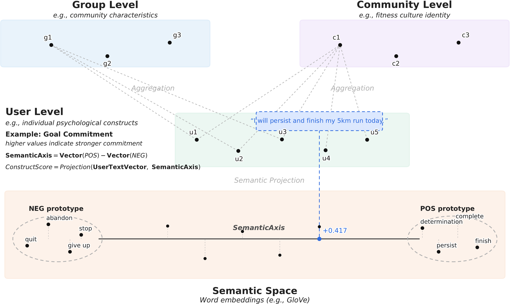

# Measuring Psychological Constructs from Social Media Text Using the Word Embedding Projection Approach

This folder provides a compact, paper-oriented demonstration of the Word Embedding Projection Approach (WEPA) with cntext.

## Install cntext

Install the released package:

```bash
pip install cntext --upgrade
```

If you are reviewing or running this repository locally, install cntext from the repository root:

```bash
pip install -e .
```

Recommended Python versions: Python 3.9 to 3.12.

## What Is WEPA?

The Word Embedding Projection Approach (WEPA) is a theory-driven semantic projection workflow for measuring construct-related linguistic salience in text. It uses anchor words to define a semantic axis in a word-embedding space. A text is then projected onto that axis to estimate how strongly the text expresses meanings associated with the construct.



The figure illustrates the idea of representing constructs through concept hierarchies and semantic projection. In WEPA, theory-driven anchor words define a semantic axis, and texts are scored according to their projection on that axis.

For example, a goal-commitment axis can be defined by a positive pole such as:

```text
坚持, 努力, 完成, 目标
```

Translations: persist, strive, complete, goal.

and a negative pole such as:

```text
放弃, 拖延, 逃避, 懈怠
```

Translations: give up, delay, avoid, slack off.

WEPA scores are text-based indicators of construct-related linguistic salience. They should not be interpreted as direct observations of latent psychological states, clinical diagnoses, causal effects, or proof of strict measurement invariance.

## How cntext Supports WEPA

cntext provides the core building blocks needed for the WEPA workflow:

- `ct.read_files` reads multiple text or CSV files into a research dataset.
- `ct.clean_text(..., lang="chinese")` performs lightweight text cleaning.
- `ct.GloVe` and `ct.Word2Vec` train domain-specific word embeddings.
- `ct.load_w2v` loads saved embedding models.
- `ct.generate_concept_axis` constructs a semantic axis from positive and negative anchor words.
- `ct.project_text` projects a text onto an existing semantic axis.
- `ct.wepa` performs semantic-axis construction and text scoring in one compact call.

The one-line scoring interface is:

```python
import cntext as ct

wv = ct.load_w2v('outputs/corpus-Word2Vec.200.15.bin')
score = ct.wepa(
    wv=wv,
    text="今天完成了5公里跑步，坚持训练很有成就感。",
    poswords=["坚持", "努力", "完成", "目标"],
    negwords=["放弃", "拖延", "逃避", "懈怠"],
    lang="chinese",
)
```

Translation of the text: "I completed a 5 km run today and feel accomplished for keeping up with training."

## Why cntext Makes WEPA Easier

Without a package-level workflow, researchers need to write separate code for file aggregation, text cleaning, embedding training, vector loading, semantic-axis construction, projection scoring, and batch scoring. cntext connects these steps with a small set of consistent functions.

This makes the workflow easier to:

- inspect,
- rerun,
- document,
- test,
- adapt to a new corpus,
- explain in a reproducibility appendix.

The goal is not to hide the measurement choices. Instead, cntext helps make the choices explicit: corpus, preprocessing, embedding model, anchor words, semantic axis, text scoring, and interpretation.

## Research Value

WEPA is useful for psychological, behavioral, and computational social science research because many constructs are expressed indirectly through language. Social media text, fitness logs, comments, diaries, and other user-generated texts often contain signals of motivation, self-efficacy, goal commitment, perceived difficulty, social support, and emotional experience.

WEPA provides a transparent way to link theory-driven construct definitions to embedding-based text indicators:

1. Researchers define the construct from theory.
2. Experts review positive and negative anchor words.
3. A domain-specific embedding model represents word meanings in context.
4. Texts are scored by semantic projection onto the construct axis.
5. Scores are validated against human judgment, external measures, temporal patterns, or other empirical evidence.

This is especially valuable when researchers need scalable text-based indicators while still preserving a clear connection to theory and measurement assumptions.

## Demo Files

Follow these files in order:

1. [`2. Build-Corpus.md`](2.%20Build-Corpus.md): read multiple CSV files, clean Chinese text, save `all_texts.csv`, and create `corpus.txt`.
2. [`3. Train-Embeddings.md`](3.%20Train-Embeddings.md): train GloVe and Word2Vec embeddings from `corpus.txt`, evaluate GloVe, load saved models, and inspect nearest neighbors.
3. [`4. Semantic-Axis-And-Scoring.md`](4.%20Semantic-Axis-And-Scoring.md): define anchor words, construct a semantic axis, score texts with `project_text`, and use one-line `ct.wepa`.

## Responsible Interpretation

WEPA scores indicate construct-related linguistic salience in text. They do not directly measure latent psychological states. Claims about measurement stability, longitudinal comparability, or cross-platform generalizability require additional validation.

Anchor-word dictionaries are domain-specific measurement resources. They should be developed from theory, reviewed by domain experts, and validated empirically before being used in new languages, platforms, time periods, or cultural contexts.
